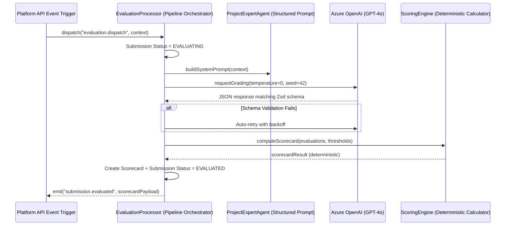

# 🤖 EvaluatorCore: Structured Event-Driven AI Rubric Grading Engine

EvaluatorCore is a **framework-agnostic, production-grade AI grading library** designed to evaluate complex student coding workspaces, essays, or text artifacts against strict, multi-weighted JSON rubrics.

By combining structured **Zod schema contracts** with highly deterministic scoring algorithms and event-driven pipelines, EvaluatorCore guarantees that AI graders generate type-safe, validated scorecards without fuzzy parsing errors.


---

## ✨ Features

- **🛡️ Strict Schema Contracts**: Enforces LLM grading models to output raw JSON objects conforming exactly to type-safe Zod schemas. Wipes out fuzzy markdown completions.
- **⚖️ Deterministic Scoring Engine**: Aggregates criteria metrics, weights, and overall pass-fail conditions with 100% mathematical determinism. Zero API drift.
- **🚥 Human-in-the-Loop Guardrails**: Automatically detects anomalies (e.g., low grading confidence, plagiarism alerts, AI-generated code leaks) and routes submissions to a manual review queue.
- **📦 Zero Framework Lock-In**: Works seamlessly with NestJS, Express, Fastify, or plain Node.js applications.

---

## 🛠 Getting Started

### 1. Installation
Clone the repository, navigate into the directory, and install dependencies:
```bash
npm install
```

### 2. Run the Demo
Launch the simulated evaluation demo to see the orchestrator, agent schemas, and grading calculations in action:
```bash
npm run demo
```

---

## 🌎 Enterprise Architecture: Grading Pipeline Design

In production setups (like **[projectstudy.in](https://projectstudy.in)**), EvaluatorCore acts as the core scoring orchestrator. It receives event triggers, calls advanced OpenAI models with structured prompts, and saves ledger-like grading records.



---

## 📁 Repository Structure

```
evaluator-core/
├── src/
│   ├── schemas/
│   │   └── agent-evaluation.schema.ts  # Zod contracts & evaluation context types
│   ├── engine/
│   │   └── scoring.engine.ts           # Deterministic metrics aggregator
│   ├── agent/
│   │   └── expert.agent.ts             # Agent prompt compilers & markdown cleansers
│   ├── orchestrator/
│   │   └── evaluation.processor.ts     # Orchestration pipeline
│   └── demo.ts                         # Executable CLI grading simulation
├── tsconfig.json
├── package.json
└── README.md
```

---

## 📜 Extensibility: How to configure your Rubrics

EvaluatorCore accepts multi-weighted rubrics dynamically in the `EvaluationContext`:

```typescript
const context = {
  submission: {
    id: "sub_01",
    files: [{ name: "script.py", type: "CODE", content: "..." }]
  },
  project: {
    title: "SQL Performance Optimization",
    instructions: "Write queries using proper index arrays...",
    evaluationCriteria: [
      { criterion: "Query Speed", weight: 0.6, description: "Optimize joins and limit scans." },
      { criterion: "Index Allocation", weight: 0.4, description: "Add covering indexes." }
    ]
  }
};
```

---

## 📜 License
This open-source engine is licensed under the **[MIT License](LICENSE)**. 

Check out **[projectstudy.in](https://projectstudy.in)** for enterprise support, multi-agent evaluation suites, and interactive educational workspaces!
