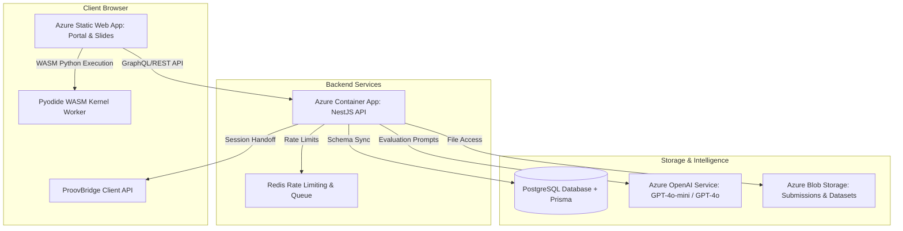

# 🌊 SlideVibe: Immersive Interactive Slide Engine with Browser-Native Python Execution

SlideVibe is a **highly interactive, client-side slide learning engine** designed to host rich data science, engineering, and analytical challenges completely inside browser environments. 

By leveraging **Pyodide** (CPython compiled to WebAssembly) and high-performance Web Workers, SlideVibe runs a full python environment in a separate background thread. Users can load datasets, manipulate dataframes using Pandas, and generate detailed charts with Matplotlib—**running entirely in-browser, with 0% dependency on remote code compilation servers.**

This repository represents the **open-source core interactive engine** that powers the virtual work-experience platform at **[projectstudy.in](https://projectstudy.in)**.

---

## 🚀 The SlideVibe Stack

- **Frontend Core**: React 19 + Vite 6 (ultra-fast module hot-reloading).
- **Styling**: Tailwind v4 (utilizing utility variables and modern design tokens).
- **Code Editor**: CodeMirror 6 (configured for Python syntax, custom styling, and keyboard mapping).
- **Execution Kernel**: Pyodide WebAssembly running inside an isolated multi-threaded Web Worker.
- **Physics & Motion**: Framer Motion (`motion`) for smooth 3D warp tunnel entrance sequences.

---

## 🌎 Enterprise Architecture: The Broader Monorepo

While this repository is a self-contained, offline-first showcase, in production at **[projectstudy.in](https://projectstudy.in)** (Proov), SlideVibe operates as a modular frontend submodule within a highly scalable, secure cloud ecosystem.



### ☁️ Azure Infrastructure Breakdown
For developers interested in scaling SlideVibe to an enterprise educational platform, our private production infrastructure utilizes the following managed resources:

1. **Azure Static Web Apps**: Hosts the compiled static React/Vite slide package and the student/admin Next.js dashboard portal globally at edge breakpoints.
2. **Azure Container Apps (NestJS API)**: A serverless containerized API layer that manages student enrollments, credit transactions, and evaluation event dispatches.
3. **Azure OpenAI Service**: Powers our floating context-aware **AI Coach** panels and the automated single-agent evaluation pipeline (matching custom versioned rubrics).
4. **Azure Database for PostgreSQL**: Logical databases (`proov` and `proov_staging`) managed through **Prisma ORM** with ledger-like append-only transactional tables.
5. **Azure Blob Storage**: Stores student file submissions and large analytical datasets which are securely mounted in Pyodide.

---

## 🛠 Getting Started

### 1. Installation
Clone the repository, navigate into the folder, and install the dependencies:
```bash
git clone https://github.com/YOUR_GITHUB_USERNAME/slidevibe.git
cd slidevibe
npm install
```

### 2. Running Locally
Spin up the local development server:
```bash
npm run dev
```
Open **http://localhost:5173** to run the engine and explore the interactive Climate Data Science warmup challenge!

### 3. Production Build
Compile and minify the assets for deployment:
```bash
npm run build
```
The optimized bundle will be compiled into the `dist/` directory, ready to be hosted on any static hosting provider (e.g., Azure Static Web Apps, Netlify, Vercel, or GitHub Pages).

---

## 📁 Repository Structure

```
slidevibe/
├── public/
│   ├── pyodideWorker.js          # Web Worker bootstrapping Pyodide WASM
│   └── data/
│       └── climate_data.csv      # Sample data science CSV dataset
├── src/
│   ├── components/
│   │   ├── AiCoachPanel.tsx      # Sliding tutoring overlay panel
│   │   ├── CinematicIntro.tsx    # Styled warp-tunnel entry animation
│   │   ├── CodeCell.tsx          # CodeMirror cell executing browser-native python
│   │   └── SlideLayout.tsx       # Core slide split-screen layout component
│   ├── lib/
│   │   ├── pyodideKernel.ts      # Thread controller communicating with the worker
│   │   ├── PyodideProvider.tsx   # React context for warming up the python kernel
│   │   └── proovBridge.ts        # Handoff interface (mocked for offline standalone use)
│   ├── projects/
│   │   ├── climate-challenge/    # Sample data science challenge folder
│   │   │   ├── manifest.json     # Declarative schema (titles, steps, questions)
│   │   │   └── index.tsx         # Slide step components
│   │   └── index.ts              # Course registry switch
│   ├── App.tsx                   # Standalone manifest player
│   └── index.css                 # Sleek UI design tokens & styling
├── package.json
└── README.md
```

---

## 🛠 Extensibility: How to Write Custom Slide Challenges

The SlideVibe engine is entirely driven by declarative course manifests. To create your own coding challenge, you only need to define two components:

### 1. Create a `manifest.json`
Define your challenge metadata, corporate styling, evaluation criteria, and questions inside the challenge directory:

```json
{
  "key": "climate-challenge",
  "display": {
    "title": "Climate Data Science Challenge",
    "description": "Analyze temperature anomaly datasets...",
    "role": "Lead Scientist",
    "themeColor": "#8b5cf6",
    "logoText": "C"
  },
  "backend": {
    "domain": "DATA_SCIENCE",
    "tags": ["python", "data-science"],
    "slides": [
      {
        "slideKey": "eda_step_1",
        "question": "What is the average deviation?",
        "responseType": "TEXT"
      }
    ]
  }
}
```

### 2. Create the Slide Components (`index.tsx`)
Create your custom slide slides using our layout primitives. Primitives like `<ContentLayout>` automatically arrange text steps on the left and interactive Python cells on the right:

```tsx
import React from 'react';
import { ContentLayout } from '../../components/SlideLayout';
import { CodeCell } from '../../components/CodeCell';

export const myChallengeSlides = [
  () => (
    <ContentLayout
      isActive={true}
      topStripClass="bg-violet-500"
      rightPanelBg="bg-slate-950"
      rightPanel={
        <CodeCell
          slideKey="setup_cell"
          initialCode="import pandas as pd\nprint('Let\'s run python!')"
          autoRun={true}
        />
      }
    >
      <h1>Welcome to the Challenge</h1>
      <p>Follow the instructions on the right to complete the cell.</p>
    </ContentLayout>
  )
];
```

---

## 🔒 Security & Architecture Guardrails

- **Thread Isolation**: The Pyodide WebAssembly runtime runs exclusively inside a background Web Worker. This isolates the heavier Python calculation, charting, and standard library loading operations from the main React render loop, guaranteeing **60fps UI rendering** during execution.
- **Cross-Origin Security**: Because Pyodide utilizes advanced JavaScript arrays to share memory buffers, the Vite server headers are configured with `Cross-Origin-Opener-Policy: same-origin` and `Cross-Origin-Embedder-Policy: credentialless`.

---

## 📜 License
This open-source core is licensed under the **[MIT License](LICENSE)**. 

If you are building virtual work experiences, check out **[projectstudy.in](https://projectstudy.in)** for the full-featured dashboard portals, multi-agent AI scoring engines, and enterprise partners registry!
